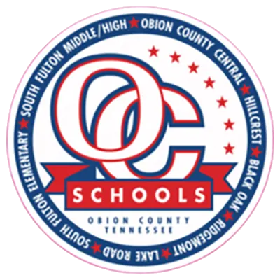
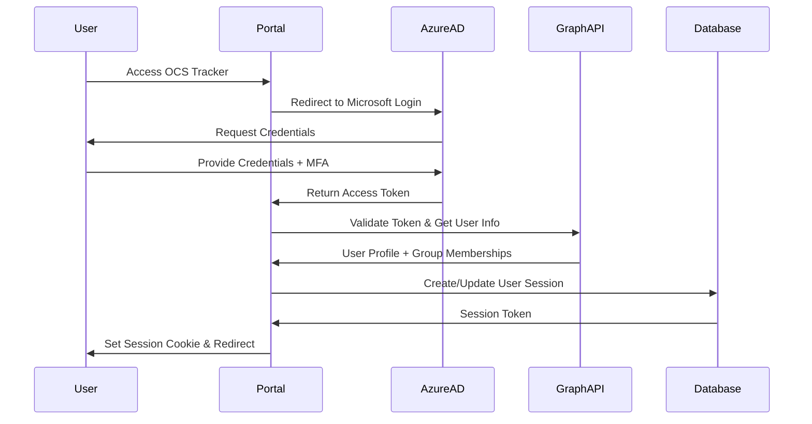
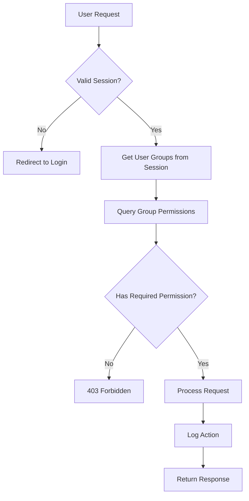

# 🔐 OCS Tracker Authentication & Authorization System

<p align="center">
  
</p>

<h3 align="center" style="color: #6a1b9a;">Microsoft Graph Integration for Role-Based Access Control</h3>

---

## 📋 Overview

The OCS Tracker authentication system integrates with **Microsoft Graph API** to provide seamless single sign-on (SSO) using existing Azure Active Directory (AAD) accounts. Users are automatically granted access levels based on their Azure AD group memberships, eliminating the need for separate user management.

### **Current Status: NOT IMPLEMENTED**
- ❌ No authentication currently exists
- ❌ All portal access is unrestricted
- ❌ Security risk for production deployment
- ✅ User management infrastructure exists in shared models
- ✅ Role-based system design ready for implementation

---

## 🎯 Authentication Goals

### **Primary Objectives**
1. **Seamless Integration**: Use existing OCS Azure AD accounts
2. **Role-Based Access**: Different permissions based on staff roles
3. **Department Isolation**: Users only see relevant data for their department
4. **Audit Trail**: Track user actions for compliance
5. **Session Management**: Secure token-based sessions

### **Security Requirements**
- Multi-factor authentication through Azure AD
- Session timeout after inactivity
- Secure token storage and transmission
- Permission validation on every API call
- Audit logging of sensitive operations

---

## 👥 User Roles & Permissions

### **Azure AD Group Mapping**

| Azure AD Group or User Attribute | OCS Role | Access Level | Description |
|---|---|---|---|
| `Technology Department` | Super Admin | Full Access | Complete system administration and technical support |
| extensionAttribute10="Director of Schools" | Super Admin | Full Access | Executive leadership with full administrative rights |
| `Finance` | Super Admin | Full Access | Financial administration with full system access |
| `All_Staff` | Staff User | Limited Write | Submit tickets/requisitions, view own submissions |
| `All_Students` | Student User | Basic Access | Submit and view own tickets only |

### **Permission Matrix**

| Service | Technology Dept | Director of Schools (Attr) | Finance | All_Staff | All_Student |
|---|---|---|---|---|---|
| **Tickets** | Admin | Admin | Admin | Create/View Own | Create/View Own |
| **Inventory** | Admin | Admin | Admin | Read Only | None |
| **Purchasing/Requisitions** | Admin | Admin | Admin | Submit/View Own | None |
| **Forms** | Admin | Admin | Admin | Submit Own | None |
| **User Management** | Admin | Admin | Admin | None | None |
| **Reports** | Admin | Admin | Admin | None | None |
| **System Administration** | Admin | Admin | Limited | None | None |

---

## 🔧 Technical Architecture

### **Authentication Flow**



### **Authorization Flow**



---

## 🗄️ Database Schema

### **Authentication Tables**

#### **group_roles**
Manages Azure AD group to permission mappings
```sql
- id (Primary Key)
- azure_group_id (Azure AD Group Object ID)
- group_name (Display Name)
- access_level (read/write/admin/super_admin)
- tickets_access (Service-specific permissions)
- inventory_access
- purchasing_access
- forms_access
- allowed_departments (JSON array)
- created_at
- updated_at
```

#### **user_sessions**
Tracks active user sessions
```sql
- id (Primary Key)
- user_id (Azure AD User ID)
- email
- display_name
- access_level
- azure_groups (JSON array)
- effective_permissions (JSON object)
- session_token (JWT)
- expires_at
- created_at
- last_activity
```

#### **audit_log**
Security and compliance tracking
```sql
- id (Primary Key)
- user_id
- action_type
- resource_type
- resource_id
- details (JSON)
- ip_address
- user_agent
- timestamp
```

---

## 🔐 Security Implementation

### **Token Management**
- **JWT Tokens**: Stateless authentication with configurable expiration
- **Refresh Tokens**: Automatic session renewal for active users
- **Token Revocation**: Immediate logout capability across all sessions
- **Secure Storage**: HTTP-only cookies with SameSite protection

### **Session Security**
- **Sliding Expiration**: Sessions extend with activity (max 8 hours)
- **Concurrent Session Limits**: Maximum 3 active sessions per user
- **Device Tracking**: Monitor login locations and devices
- **Automatic Logout**: Inactivity timeout after 30 minutes

### **API Protection**
- **Authentication Middleware**: Every API call validates token
- **Permission Decorators**: Route-level access control
- **Rate Limiting**: Prevent abuse and DoS attacks
- **Input Validation**: Sanitize all user inputs

---

## 📊 Permission Examples

### **Scenario 1: Staff Member Creates Ticket**
1. **User**: Ms. Johnson (All_Staff group)
2. **Action**: Create new tech support ticket
3. **Permissions Check**:
   - ✅ Has `tickets_access: write`
   - ✅ Can create tickets
   - ❌ Cannot assign to other technicians
   - ❌ Cannot view other users' tickets
4. **Result**: Ticket created with `created_by: ms.johnson@ocs.edu`

### **Scenario 2: Student Creates Ticket**
1. **User**: John Smith (All_Student group)
2. **Action**: Create new tech support ticket
3. **Permissions Check**:
   - ✅ Has `tickets_access: write`
   - ✅ Can create tickets
   - ❌ Cannot access purchasing/requisitions
   - ❌ Cannot view other users' tickets
4. **Result**: Ticket created with `created_by: john.smith@student.ocs.edu`

### **Scenario 3: Technology Department System Admin**
1. **User**: IT Admin (Technology Department group)
2. **Action**: Manage user permissions and view all system data
3. **Permissions Check**:
   - ✅ Has `access_level: super_admin`
   - ✅ Can modify group role mappings
   - ✅ Can view audit logs
   - ✅ Can access all services and data
4. **Result**: Full administrative access granted

### **Scenario 4: Director of Schools Views Reports**
1. **User**: Superintendent (Director of Schools group)
2. **Action**: View district-wide reports and manage operations
3. **Permissions Check**:
   - ✅ Has `access_level: super_admin`
   - ✅ Can view all school and district data
   - ✅ Can manage staff and resources
   - ✅ Can access financial information
4. **Result**: Complete oversight access granted

### **Scenario 5: Finance Staff Manages Purchasing**
1. **User**: Finance Director (Finance group)
2. **Action**: Process and approve requisitions
3. **Permissions Check**:
   - ✅ Has `access_level: super_admin`
   - ✅ Can view all purchasing requests
   - ✅ Can approve/deny requisitions
   - ✅ Can manage budget allocations
4. **Result**: Full financial management access granted

---

## 🚀 Implementation Plan

### **Phase 1: Core Authentication (Week 1)**
- [ ] Set up Azure AD application registration
- [ ] Implement Microsoft Graph integration
- [ ] Create authentication middleware
- [ ] Add login/logout endpoints
- [ ] Basic session management

### **Phase 2: Authorization Framework (Week 2)**
- [ ] Create group role management system
- [ ] Implement permission decorators
- [ ] Add authorization middleware to all APIs
- [ ] Create admin interface for group management
- [ ] Test role-based access control

### **Phase 3: Security Hardening (Week 3)**
- [ ] Add audit logging
- [ ] Implement rate limiting
- [ ] Add session security features
- [ ] Security testing and validation
- [ ] Documentation and training

### **Phase 4: Advanced Features (Week 4)**
- [ ] Department-based filtering
- [ ] Advanced reporting permissions
- [ ] API key management for external integrations
- [ ] Mobile device support
- [ ] Performance optimization

---

## 🛠️ Configuration Requirements

### **Azure AD Setup**
```yaml
Required App Registrations:
  - OCS-Tracker-Portal
    - Redirect URIs: https://tracker.ocs.edu/auth/callback
    - API Permissions: User.Read, GroupMember.Read.All
    - Secret: Generate client secret for authentication

Required Groups:
  - Technology Department
  - Director of Schools
  - Finance
  - All_Staff
  - All_Student
```

### **Environment Variables**
```bash
# Azure Configuration
AZURE_CLIENT_ID=your_app_client_id
AZURE_CLIENT_SECRET=your_app_client_secret
AZURE_TENANT_ID=your_tenant_id
AZURE_REDIRECT_URI=https://tracker.ocs.edu/auth/callback

# Security Configuration
JWT_SECRET=random_256_bit_secret
SESSION_TIMEOUT_MINUTES=30
MAX_CONCURRENT_SESSIONS=3

# Feature Flags
ENABLE_AUDIT_LOGGING=true
ENABLE_RATE_LIMITING=true
ENABLE_MFA_REQUIRED=true
```

---

## 📝 API Endpoints

### **Authentication Endpoints**
```http
GET  /login                    # Display login page
POST /auth/microsoft          # Initiate Microsoft OAuth flow
POST /auth/callback           # Handle OAuth callback
GET  /auth/user               # Get current user info
POST /logout                  # End user session
GET  /auth/status            # Check authentication status
```

### **Authorization Endpoints**
```http
GET  /admin/groups           # Manage group role mappings
POST /admin/groups           # Create new group role
PUT  /admin/groups/{id}      # Update group permissions
GET  /admin/users            # View user sessions
GET  /admin/audit            # View audit logs
```

### **Permission-Protected Endpoints**
```http
# All existing portal routes become protected:
GET  /tickets               # Requires: tickets_access >= read
POST /tickets               # Requires: tickets_access >= write
GET  /inventory             # Requires: inventory_access >= read
POST /purchasing/request    # Requires: purchasing_access >= write
GET  /admin/*              # Requires: access_level >= admin
```

---

## 🔍 Testing Strategy

### **Authentication Testing**
- [ ] Valid Azure AD login flow
- [ ] Invalid credentials handling
- [ ] Token expiration and refresh
- [ ] Session security validation
- [ ] Logout functionality

### **Authorization Testing**
- [ ] Role-based access control
- [ ] Permission boundary testing
- [ ] Cross-service authorization
- [ ] Department isolation
- [ ] Privilege escalation prevention

### **Security Testing**
- [ ] JWT token validation
- [ ] Session hijacking prevention
- [ ] CSRF protection
- [ ] XSS prevention
- [ ] SQL injection protection

---

## 📚 Resources & Documentation

### **Microsoft Graph Resources**
- [Microsoft Graph Authentication](https://docs.microsoft.com/en-us/graph/auth/)
- [Group Management API](https://docs.microsoft.com/en-us/graph/api/group-list)
- [User Permissions](https://docs.microsoft.com/en-us/graph/permissions-reference)

### **Security Best Practices**
- [OWASP Authentication Guide](https://owasp.org/www-project-top-ten/)
- [JWT Security Best Practices](https://tools.ietf.org/html/rfc8725)
- [Azure AD Security](https://docs.microsoft.com/en-us/azure/active-directory/fundamentals/security-operations)

### **Implementation References**
- [FastAPI Authentication](https://fastapi.tiangolo.com/tutorial/security/)
- [SQLAlchemy User Models](https://docs.sqlalchemy.org/en/14/orm/basic_relationships.html)
- [Docker Security](https://docs.docker.com/engine/security/)

---

## ⚠️ Current Security Risk

**CRITICAL**: The OCS Tracker portal is currently **completely unsecured**. Any user with network access can:

- View all sensitive ticket information
- Access financial purchasing data  
- Modify inventory records
- Create/delete tickets and requisitions
- Access user management functions

**Immediate Actions Required**:
1. 🚨 **Deploy only in secure internal networks**
2. 🔒 **Implement authentication before production use**
3. 📝 **Add network-level access controls**
4. 🔍 **Monitor access logs for unauthorized usage**

---

<p align="center" style="color: #b71c1c;">
<b>Security Notice</b><br>
This authentication system design is for Obion County Schools internal use only.<br>
Unauthorized access or distribution of this documentation is prohibited.
</p>

---

*Last Updated: June 12, 2025*  
*Version: 1.0 - Design Phase*  
*Next Review: Implementation Phase Start*
