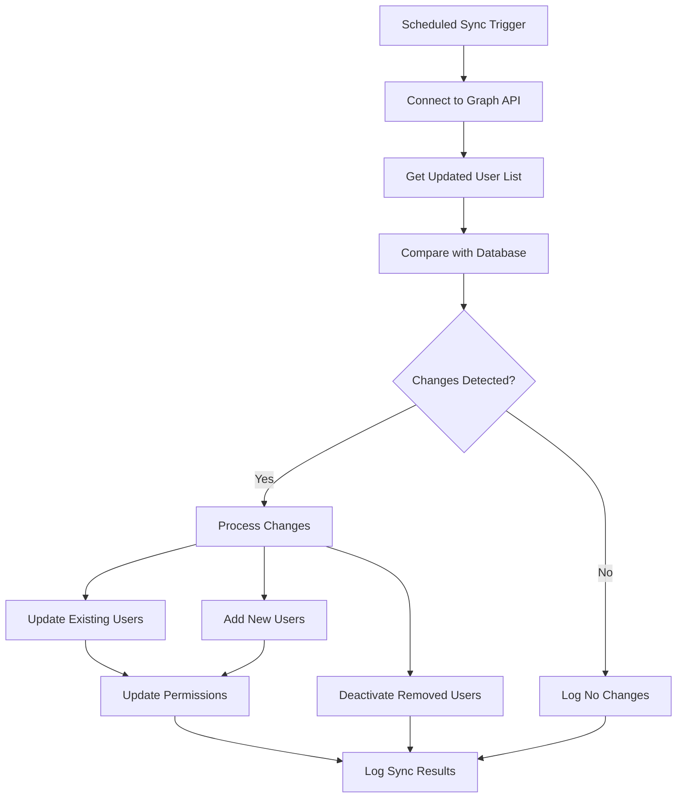
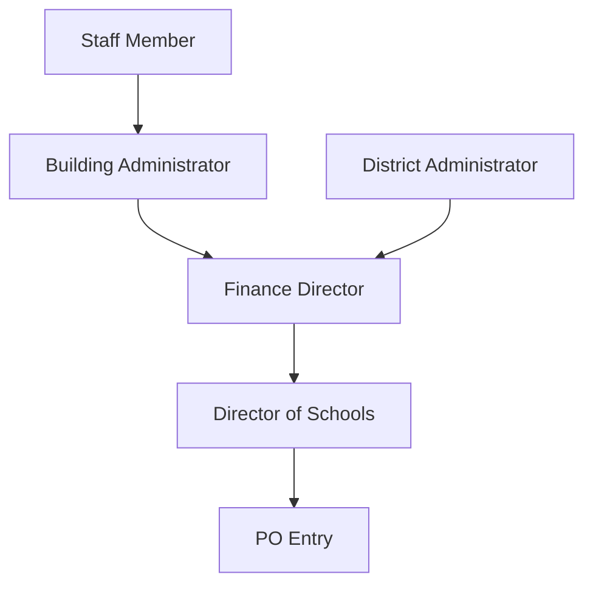

# 👥 Azure AD User Import Process

<p align="center">
  
</p>

<h3 align="center" style="color: #6a1b9a;">Microsoft Graph API Integration for User Management</h3>

---

## 📋 Overview

This document details the process for importing and synchronizing user data from Azure Active Directory (AAD) to the OCS Tracker system. This integration ensures that user accounts, roles, and permissions are accurately maintained across the platform without requiring manual user management.

### **Current Status: PLANNED**
- ❌ User import process not yet implemented
- ✅ Database schema ready for user data
- ✅ Azure AD group structure defined
- ✅ Role mapping architecture designed
- ✅ Organizational hierarchy schema designed

---

## 🎯 Import Goals

### **Primary Objectives**
1. **Automated Synchronization**: Regular sync of user data from Azure AD
2. **Role Mapping**: Automatic assignment of permissions based on Azure groups
3. **User Deprovisioning**: Handle departing staff and students
4. **Initial Data Population**: Bulk import of all current users
5. **Incremental Updates**: Efficient updates for new or changed users

### **Data Requirements**
- User profile information (name, email, etc.)
- Group memberships for role assignment
- Department affiliations
- Account status (active/inactive)
- User type (staff/student/admin)
- Building/District assignment (via officeLocation)
- Administrator status (via extensionAttribute10)

---

## 📊 Import Process

### **Initial Import Flow**

1. **Authentication Setup**
   - Register application in Azure AD
   - Obtain necessary API permissions
   - Generate and secure client credentials

2. **Data Mapping**
   - Map Azure AD attributes to database schema
   - Define group to permission translations
   - Create department filtering rules
   - Configure building administrator detection
   - Set up building vs. district assignment logic

3. **Bulk Import Execution**
   - Connect to Microsoft Graph API
   - Retrieve all users with required attributes
   - Process group memberships
   - Detect building administrators via extensionAttribute10
   - Identify building/district assignments via officeLocation
   - Create database records
   - Generate initial access levels

4. **Validation**
   - Verify user count matches Azure AD
   - Confirm group memberships properly assigned
   - Test authorization rules against imported data
   - Validate department filtering
   - Verify building administrator detection
   - Confirm building/district assignments

### **Synchronization Process**



---

## 💼 User Data Model

### **Imported User Attributes**
- **employeeId**: Unique identifier (primary key)
- **Display Name**: Full name for display
- **Email**: Primary email address
- **Job Title**: Position/role information
- **Department**: Organizational unit
- **User Principal Name**: Login identifier
- **Account Status**: Active/inactive flag
- **Group Memberships**: All assigned Azure groups
- **Created Date**: Account creation timestamp
- **Last Modified**: Last update timestamp
- **Office Location**: Building assignment or "Assigned To District"
- **Extension Attribute 10**: Used to identify building administrators

### **Generated User Properties**
- **Access Level**: Computed from group memberships
- **Service Permissions**: Individual service-specific rights
- **Department Access**: Which departments user can view
- **Data Filtering Rules**: Record visibility constraints
- **Special Flags**: Admin, super-admin, etc.
- **Is Building Admin**: True for building administrators
- **Is District Level**: True for district-wide staff
- **Building Assignment**: School location based on officeLocation

---

## 🏫 Building and Administrator Detection

### **Database Schema Extensions**

```sql
-- User model extensions
ALTER TABLE users
ADD COLUMN employee_id VARCHAR(255) UNIQUE,
ADD COLUMN is_building_admin BOOLEAN DEFAULT FALSE,
ADD COLUMN is_district_level BOOLEAN DEFAULT FALSE,
ADD COLUMN building_assignment VARCHAR(255),
ADD COLUMN supervisor_email VARCHAR(255),
ADD COLUMN extension_attribute_10 VARCHAR(255),
ADD COLUMN office_location VARCHAR(255),
ADD COLUMN azure_groups JSONB,
ADD COLUMN last_sync TIMESTAMP;

-- Organizational hierarchy table
CREATE TABLE organizational_hierarchy (
    id SERIAL PRIMARY KEY,
    employee_id INTEGER REFERENCES users(id),
    employee_email VARCHAR(255) NOT NULL,
    supervisor_id INTEGER REFERENCES users(id),
    supervisor_email VARCHAR(255) NOT NULL,
    department VARCHAR(255),
    is_direct_report BOOLEAN DEFAULT TRUE,
    building VARCHAR(255),
    created_at TIMESTAMP DEFAULT CURRENT_TIMESTAMP,
    updated_at TIMESTAMP DEFAULT CURRENT_TIMESTAMP
);

-- Building supervisors view
CREATE VIEW building_supervisors AS
SELECT u.id, u.display_name, u.email, u.building_assignment
FROM users u
WHERE u.is_building_admin = TRUE;
```

### **Building vs. District Assignment**
The system uses Azure AD properties to determine if a user is assigned to a specific building or serves at the district level:

- **Office Location Attribute**: Contains the school name or "Assigned To District"
  - Example: "East Elementary" assigns user to that specific building
  - Example: "Assigned To District" marks user as district-level staff
  - If empty, defaults to district-level assignment

### **Administrator Detection Logic**
Administrators are identified by:

- **Extension Attribute 10**: Used to identify administrators:
  - Contains "Admin Principal" for building administrators
  - Contains "Director of Schools" for the district superintendent
  - Always used in combination with Office Location to determine assignment level

### **Organization Hierarchy Construction**
The system creates a supervisor-employee relationship tree based on:

- **Building administrators**: Automatically assigned as supervisors for staff in their building
- **Department directors**: Assigned as supervisors for their department members
- **Director of Schools**: Top-level supervisor for all district administrators
- **Technology Department**: Special case with direct reporting to Director of Schools

### **Administrator Classification Examples**

| Name | Job Title | Office Location | Extension Attribute 10 | Classification |
|------|-----------|-----------------|------------------------|---------------|
| Jane Smith | Principal | East Elementary | Admin Principal | Building Administrator |
| John Davis | Assistant Principal | West High School | Admin Principal | Building Administrator |
| Robert Jones | Technology Director | Assigned To District | (empty) | District Administrator |
| Susan Miller | Teacher | East Elementary | (empty) | Building Staff |
| Mark Wilson | Superintendent | Assigned To District | Director of Schools | Director of Schools |

## 🔄 Synchronization Schedule

### **Regular Sync Schedule**
- **Full Sync**: Daily at midnight
- **Delta Sync**: Hourly during business hours
- **On-Demand Sync**: Available via admin interface
- **Post-Import Validation**: Automatic checks after each sync

### **Sync Monitoring**
- Sync history and logs maintained
- Error notifications for failed syncs
- User count discrepancy alerts
- Manual override capabilities for admins

---

## 📈 Usage Scenarios

### **Scenario 1: New Staff Member Onboarding**
1. HR adds user to Azure AD
2. User is placed in appropriate Azure groups (All_Staff + departments)
3. Next scheduled sync detects new user
4. User account created with proper permissions
5. User can immediately login with Azure credentials

### **Scenario 2: Staff Role Change**
1. Administrator updates user's Azure AD group memberships
2. Next sync cycle detects group membership changes
3. System updates user's permissions accordingly
4. New access rights applied immediately
5. Audit log records permission changes

### **Scenario 3: Student Graduation/Departure**
1. Student is removed from relevant Azure AD groups
2. Sync process detects group membership change
3. System adjusts permissions accordingly or deactivates account
4. Historical records maintained with inactive user reference
5. Account remains in system but cannot access platform

### **Scenario 4: Department Transfer**
1. Staff member's department attribute updated in Azure AD
2. Sync process detects attribute change
3. System updates department filtering rules
4. User now sees data only for new department
5. Historical tickets/requests remain accessible to previous department staff

### **Scenario 5: Building Administrator Assignment**
1. Staff member is promoted to Principal
2. Azure AD attributes updated:
   - extensionAttribute10 set to "Admin Principal"
   - officeLocation set to assigned school
3. Next sync detects administrator status change
4. User automatically assigned building administrator role
5. Gains supervisor approval permissions for their building
6. User appears in organizational hierarchy as supervisor

### **Scenario 6: Building Transfer**
1. Teacher transfers from East Elementary to West High School
2. HR updates officeLocation in Azure AD
3. Sync process detects location change
4. System reassigns user to new building
5. Approval chain automatically updated with new supervisor
6. User now sees data relevant to new building

---

## ⚙️ Configuration Options

### **Sync Settings**
- Sync frequency (hours)
- Full sync schedule (time of day)
- Error notification recipients
- Automatic retry settings
- Attribute mapping overrides

### **Group Mappings**
- Custom role definitions
- Group to permission mapping
- Special case handling
- Default permissions

### **Data Retention**
- Inactive user retention period
- Historical record handling
- Data archiving rules
- Log retention policy

---

## 🛡️ Security Considerations

### **API Access Security**
- Least privilege API permissions
- Client credential secure storage
- Certificate-based authentication option
- Secret rotation schedule

### **Data Protection**
- Sensitive attributes protection
- PII handling compliance
- Storage encryption
- Transmission security

### **Audit & Compliance**
- Full sync history logs
- User permission change tracking
- Admin override documentation
- Regulatory compliance features

---

## 🚀 Implementation Plan

### **Phase 1: Infrastructure Setup (Week 1)**
- [ ] Create Azure AD application registration
- [ ] Configure API permissions (User.Read.All, GroupMember.Read.All)
- [ ] Secure credential storage
- [ ] Establish database connections
- [ ] Add building administrator fields to User model

### **Phase 2: Core Import Logic (Week 2)**
- [ ] Implement Graph API client
- [ ] Create user mapping functions
- [ ] Build group permission translator
- [ ] Develop extensionAttribute10 parsing for admins
- [ ] Implement officeLocation processing
- [ ] Develop database write operations

### **Phase 3: Organizational Hierarchy (Week 3)**
- [ ] Create organizational_hierarchy table
- [ ] Implement supervisor detection logic
- [ ] Build organizational reporting structure
- [ ] Connect with requisition approval workflow
- [ ] Test hierarchy-based routing

### **Phase 4: Sync Mechanism (Week 4)**
- [ ] Create scheduled sync process
- [ ] Implement delta sync optimization
- [ ] Add error handling and retries
- [ ] Develop validation routines
- [ ] Test building administrator synchronization

### **Phase 5: Management Interface (Week 5)**
- [ ] Build admin sync dashboard
- [ ] Add manual sync triggers
- [ ] Create sync logs viewer
- [ ] Implement hierarchy visualization
- [ ] Add administrator override functions

---

## 🛠️ Technical Requirements

### **Azure Configuration**
- Microsoft Graph API access
- Directory.Read.All permission
- Group.Read.All permission
- User.Read.All permission
- Service principal or managed identity
- Access to extensionAttribute10 and officeLocation fields

### **System Requirements**
- Scheduled task runner
- Error notification system
- Database migration support
- Logging infrastructure
- Organizational hierarchy database model

### **Performance Considerations**
- Batch processing for large directories
- Connection pooling for database operations
- Caching of frequent lookups
- Rate limiting compliance for API calls
- Efficient hierarchy traversal algorithms

### **Organizational Hierarchy Requirements**
- Building administrator detection through extensionAttribute10
- Building/district assignment through officeLocation
- Automatic supervisor assignment based on building
- Special case handling for district administrators
- Requisition approval workflow integration

---

## 📝 Testing Strategy

### **Import Testing**
- [ ] Small-scale import test
- [ ] Full directory import test
- [ ] Error condition handling
- [ ] Edge case validation
- [ ] Building administrator detection validation
- [ ] District vs. building staff assignment testing

### **Hierarchy Testing**
- [ ] Supervisor-employee relationship validation
- [ ] Multi-level hierarchy verification
- [ ] Building administrator supervisor role testing
- [ ] District administrator routing testing
- [ ] Requisition approval path verification

### **Sync Testing**
- [ ] Added user detection
- [ ] Modified user updates
- [ ] Removed user handling
- [ ] Group changes propagation
- [ ] Office location changes handling
- [ ] Administrator status changes detection

### **Performance Testing**
- [ ] Large directory import benchmark
- [ ] Sync operation timing
- [ ] Resource utilization monitoring
- [ ] Optimization verification
- [ ] Hierarchy traversal performance testing

---

## 📚 Resources & Documentation

### **Microsoft Graph Resources**
- [Microsoft Graph Users API](https://docs.microsoft.com/en-us/graph/api/resources/user)
- [Group Management API](https://docs.microsoft.com/en-us/graph/api/resources/group)
- [Delta Query](https://docs.microsoft.com/en-us/graph/delta-query-overview)
- [Batch Operations](https://docs.microsoft.com/en-us/graph/json-batching)

### **Implementation References**
- [FastAPI Background Tasks](https://fastapi.tiangolo.com/tutorial/background-tasks/)
- [SQLAlchemy Bulk Operations](https://docs.sqlalchemy.org/en/14/orm/session_api.html#sqlalchemy.orm.Session.bulk_insert_mappings)
- [APScheduler Documentation](https://apscheduler.readthedocs.io/en/stable/)

---

## 🔄 Integration with Requisition Approval Workflow

The user import system provides critical organizational hierarchy data for the requisition approval workflow:

### **Supervisor Determination**
- Building administrators automatically become supervisors for staff in their building
- Department directors become supervisors for their department staff
- Director of Schools is the supervisor for all district-level administrators

### **Approval Chain Construction**


### **Special Cases**
- **Building Administrator Requisitions**: Auto-approve supervisor stage
- **Technology Department**: Special routing through Technology Director
- **Finance Staff**: Normal routing despite being in approval chain
- **Director of Schools Requisitions**: Only requires Finance Director approval

### **Data Dependencies**
- User's `is_building_admin` flag affects approval routing
- User's `is_district_level` flag determines initial approval stage
- User's `building_assignment` determines their supervisor
- Azure AD group memberships determine approval authority

## ⚠️ Implementation Risks

**Potential Issues**:
1. 🚨 **Rate Limiting**: Microsoft Graph API has request limits
2. 🔒 **Permission Changes**: Azure AD permission model changes
3. 📝 **Large Directory**: Performance with thousands of users
4. 🔍 **Sync Failures**: Handling interrupted syncs
5. 🔄 **Consistency**: Ensuring database/Azure AD consistency
6. 🏫 **Incorrect Building Assignment**: Users assigned to wrong supervisors
7. 👥 **Administrator Detection Failures**: Missing extensionAttribute10 values

**Mitigation Strategies**:
1. ✅ Implement exponential backoff for API requests
2. ✅ Regular review of Microsoft Graph API changes
3. ✅ Pagination and batch processing optimization
4. ✅ Transaction management and checkpointing
5. ✅ Periodic full reconciliation syncs
6. ✅ Manual override capabilities for building assignments
7. ✅ Validation reports for administrator detection

---

<p align="center" style="color: #6a1b9a;">
<b>Implementation Priority</b><br>
User import functionality should be considered a <b>CRITICAL</b> component<br>
required before production deployment of the OCS Tracker system.
</p>

## 🔑 Key Recommendations

1. **Implement Early**: The user import system should be one of the first components developed, as it provides the foundation for authentication and requisition approval workflows.

2. **Azure AD Configuration**: Work with IT administrators to ensure:
   - All users have correct officeLocation values
   - Building administrators have extensionAttribute10 properly set
   - Appropriate Azure AD groups are established

3. **Validation Process**: Create a validation dashboard that:
   - Shows building administrator detection results
   - Highlights missing or incorrect hierarchy information
   - Provides summary of role assignments
   - Allows manual overrides when needed

4. **Data Cleanup**: Before implementation:
   - Audit existing Azure AD user attributes
   - Standardize building names in officeLocation
   - Create a naming convention for extensionAttribute10
   - Document the organizational hierarchy

5. **Integration Timeline**: Schedule implementation to align with:
   - Authentication system development
   - Requisition approval workflow creation
   - Beginning of academic year (if possible)

---

*Last Updated: June 12, 2025*  
*Version: 1.2 - Planning Phase*  
*Next Review: Implementation Phase Start*
