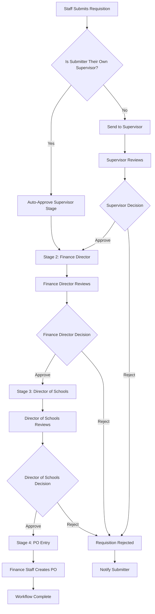

# 🔄 OCS Requisition Approval Workflow System

<p align="center">
  
</p>

<h3 align="center" style="color: #6a1b9a;">Multi-Stage Approval Process for Purchasing Requisitions</h3>

---

## 📋 Overview

The OCS Requisition Approval System implements a structured, multi-stage approval workflow for all purchasing requisitions. This system ensures proper financial oversight, accountability, and compliance with district purchasing policies through an automated, role-based approval process.

### **Current Status: DESIGN PHASE**
- ❌ Approval workflow not yet implemented
- ❌ Manual approval process currently in use
- ✅ Integration points identified with authentication system
- ✅ Database schema designed for workflow tracking
- ✅ Ready for implementation with existing Azure AD groups

---

## 🎯 Approval Workflow Goals

### **Primary Objectives**
1. **Automated Processing**: Streamlined approval routing based on organizational hierarchy
2. **Financial Oversight**: Multi-level approval ensuring budget compliance
3. **Audit Trail**: Complete tracking of all approval decisions and timelines
4. **Self-Service Management**: Reduce administrative burden through automation
5. **Integration**: Seamless connection with existing authentication and purchasing systems

### **Business Requirements**
- All requisitions must follow the established approval chain
- Supervisors who submit their own requests receive automatic supervisor approval
- Finance Director and Director of Schools approval required for all purchases
- Complete audit trail for compliance and reporting
- Email notifications at each approval stage

---

## 🔗 Approval Chain Workflow

### **4-Stage Approval Process**



### **Stage Breakdown**

| Stage | Approver | Role | Action Required | Next Step |
|-------|----------|------|-----------------|-----------|
| **1** | Direct Supervisor | Operational Approval | Review requisition details, approve/reject | Finance Director |
| **2** | Finance Director | Budget/Financial Review | Verify budget availability, approve/reject | Director of Schools |
| **3** | Director of Schools | Executive Approval | Final authorization, approve/reject | PO Entry |
| **4** | Finance Staff | Purchase Order Creation | Generate PO number, complete transaction | Workflow Complete |

---

## 👥 Role Responsibilities

### **Requisition Submitter (All_Staff)**
**Permissions**: Submit/View Own Requisitions
- Create detailed requisition requests
- Track approval status of submitted requisitions
- Respond to requests for additional information
- Receive notifications on approval decisions

### **Direct Supervisor (Organizational Hierarchy)**
**Permissions**: Approve Direct Reports' Requisitions
- Review requisitions from direct reports
- Approve or reject based on operational need
- Add comments/feedback for rejected requests
- **Special Case**: Auto-approval if supervisor submits their own requisition

### **Finance Director (Finance Group)**
**Permissions**: Full Financial Oversight
- Review all requisitions for budget compliance
- Verify funding availability
- Approve/reject based on financial policies
- Access to all financial reports and budget data

### **Director of Schools (identified by extensionAttribute10="Director of Schools")**
**Permissions**: Executive Authorization
- Final approval authority for all purchases
- District-wide oversight and compliance
- Policy compliance verification
- Emergency approval authorization

### **Finance Staff (Finance Group)**
**Permissions**: Purchase Order Management
- Create purchase orders from approved requisitions
- Generate PO numbers
- Coordinate with vendors
- Complete transaction processing

---

## 🗄️ Database Schema Design

### **Core Approval Tables**

#### **requisition_approvals**
Master approval tracking table
```sql
- id (Primary Key)
- requisition_id (Foreign Key to requisitions)
- current_stage (supervisor/finance_director/director_of_schools/po_entry/completed)
- overall_status (pending/approved/rejected/returned)
- submitted_by (User email)
- submitted_by_name
- department
- submitted_at
- completed_at
- created_at
- updated_at
```

#### **approval_stages**
Individual stage tracking
```sql
Stage 1 - Supervisor:
- supervisor_email (Auto-determined from hierarchy)
- supervisor_status (pending/approved/rejected)
- supervisor_approved_at
- supervisor_comments

Stage 2 - Finance Director:
- finance_director_status
- finance_director_approved_at
- finance_director_comments

Stage 3 - Director of Schools:
- director_schools_status
- director_schools_approved_at
- director_schools_comments

Stage 4 - PO Entry:
- po_entered_by
- po_number
- po_entered_at
```

#### **organizational_hierarchy**
Staff reporting structure
```sql
- id (Primary Key)
- employee_email (Unique identifier)
- employee_name
- supervisor_email (Reports to)
- department
- position_title
- is_supervisor (Boolean flag)
- is_finance_director (Boolean flag)
- is_director_of_schools (Boolean flag)
- created_at
- updated_at
```

#### **approval_notifications**
Notification tracking system
```sql
- id (Primary Key)
- requisition_approval_id (Foreign Key)
- recipient_email
- notification_type (pending_approval/approved/rejected/completed)
- stage (Current approval stage)
- sent_at
- read_at
- created_at
```

---

## 🔐 Security & Permissions Integration

### **Azure AD Group Integration**

| Azure AD Group or Role | Approval Permissions | System Access |
|----------------|---------------------|---------------|
| `Technology Department` | All Stages (Admin Override) | Full system administration |
| extensionAttribute10="Director of Schools" | Stage 3 (Final Approval) | Full administrative access |
| `Finance` | Stage 2 & 4 (Financial Review & PO Entry) | Full financial system access |
| `All_Staff` | Submit Only | Limited to own submissions |
| `All_Student` | No Access | No requisition privileges |

### **Permission Validation**
- **Stage 1**: Only designated supervisor can approve (unless self-approval)
- **Stage 2**: Only Finance Director group members can approve
- **Stage 3**: Only user with extensionAttribute10="Director of Schools" can approve
- **Stage 4**: Only Finance group members can create POs
- **Admin Override**: Technology Department group can manage any stage

---

## 📊 Workflow Scenarios

### **Scenario 1: Standard Teacher Requisition**
1. **Teacher** (Ms. Johnson) submits classroom supply requisition
2. **System** identifies supervisor (Principal Smith) from organizational hierarchy
3. **Principal Smith** receives notification, reviews and approves
4. **Finance Director** receives notification, verifies budget, approves
5. **Director of Schools** receives notification, provides final approval
6. **Finance Staff** receives notification, creates PO #12345
7. **Ms. Johnson** receives completion notification with PO number

### **Scenario 2: Principal Self-Requisition**
1. **Principal** (Mr. Davis) submits requisition for school equipment
2. **System** detects self-supervision, auto-approves supervisor stage
3. **Finance Director** receives immediate notification (skipping supervisor delay)
4. **Workflow continues** through normal Finance Director → Director of Schools → PO Entry

### **Scenario 3: Rejection and Re-submission**
1. **Staff Member** submits requisition with insufficient justification
2. **Supervisor** rejects with comments requesting more details
3. **Staff Member** receives rejection notification with feedback
4. **Staff Member** creates new requisition with additional information
5. **Workflow restarts** from supervisor approval stage

### **Scenario 4: Emergency Override**
1. **IT Staff** needs emergency equipment purchase
2. **Technology Department member** uses admin override to expedite
3. **System logs** override action for audit compliance
4. **Normal workflow** continues with accelerated timeline

---

## 🔔 Notification System

### **Automated Email Notifications**

#### **Pending Approval Notifications**
- **To**: Current stage approver
- **When**: Requisition enters their approval stage
- **Content**: Requisition details, submission context, approval deadline
- **Action**: Direct link to approval interface

#### **Decision Notifications**
- **To**: Previous approvers and submitter
- **When**: Approval or rejection decision made
- **Content**: Decision outcome, comments, next steps
- **Action**: Status tracking link

#### **Completion Notifications**
- **To**: All stakeholders in approval chain
- **When**: PO created and workflow completed
- **Content**: PO number, vendor information, expected delivery
- **Action**: Final receipt confirmation

#### **Reminder Notifications**
- **To**: Pending approvers
- **When**: 24/48 hours after pending assignment
- **Content**: Gentle reminder with escalation timeline
- **Action**: Quick approval interface

---

## 📈 Reporting & Analytics

### **Approval Metrics Dashboard**

#### **Performance Indicators**
- Average approval time by stage
- Rejection rates by department/supervisor
- Pending approval counts by stage
- Budget utilization tracking
- Vendor payment timeline analysis

#### **Compliance Reports**
- Complete audit trail for all requisitions
- Approval authority verification
- Budget adherence tracking
- Policy compliance monitoring
- Exception and override logging

#### **Management Insights**
- Department spending patterns
- Seasonal requisition trends
- Supervisor approval efficiency
- Budget variance analysis
- Vendor performance metrics

---

## 🛠️ Implementation Roadmap

### **Phase 1: Core Workflow Engine (Week 1-2)**
- [ ] Database schema implementation
- [ ] Organizational hierarchy setup
- [ ] Basic approval routing logic
- [ ] Integration with authentication system
- [ ] Unit testing of workflow components

### **Phase 2: User Interface Development (Week 3-4)**
- [ ] Approval dashboard for each role
- [ ] Requisition submission interface
- [ ] Status tracking for submitters
- [ ] Admin management interface
- [ ] Mobile-responsive design

### **Phase 3: Notification System (Week 5)**
- [ ] Email notification service
- [ ] In-app notification system
- [ ] Reminder and escalation logic
- [ ] Notification preferences management
- [ ] Integration testing

### **Phase 4: Reporting & Analytics (Week 6)**
- [ ] Approval metrics dashboard
- [ ] Compliance reporting tools
- [ ] Export capabilities
- [ ] Automated report scheduling
- [ ] Management insights dashboard

### **Phase 5: Testing & Deployment (Week 7-8)**
- [ ] End-to-end workflow testing
- [ ] User acceptance testing
- [ ] Performance optimization
- [ ] Security validation
- [ ] Production deployment

---

## 🔍 Quality Assurance

### **Testing Strategy**

#### **Workflow Testing**
- Complete approval chain validation
- Self-approval scenario testing
- Rejection and re-submission flows
- Admin override functionality
- Edge case handling

#### **Security Testing**
- Permission boundary validation
- Unauthorized access prevention
- Data integrity verification
- Audit trail completeness
- Cross-user data isolation

#### **Performance Testing**
- High-volume requisition processing
- Concurrent approval handling
- Database query optimization
- Notification system load testing
- System response time validation

#### **User Acceptance Testing**
- Role-based interface testing
- Workflow usability validation
- Mobile device compatibility
- Accessibility compliance
- Training material effectiveness

---

## 📋 Organizational Setup Requirements

### **Hierarchy Data Population**
- Complete staff directory with reporting relationships
- Supervisor designation for all staff members
- Department and position title information
- Special role flags (Finance Director, Director of Schools)
- Regular hierarchy maintenance procedures

### **Policy Integration**
- Purchasing policy compliance rules
- Budget approval thresholds
- Emergency requisition procedures
- Vendor approval workflows
- Contract compliance requirements

### **Training Requirements**
- Role-specific training modules
- Approval decision guidelines
- System navigation training
- Escalation procedures
- Compliance requirements education

---

## 🚀 Success Metrics

### **Operational Efficiency**
- **Target**: 50% reduction in approval processing time
- **Measurement**: Average time from submission to PO creation
- **Baseline**: Current manual process timeline

### **Compliance & Accuracy**
- **Target**: 100% audit trail completeness
- **Measurement**: All approvals properly documented and authorized
- **Validation**: Monthly compliance audits

### **User Satisfaction**
- **Target**: 90% user satisfaction rating
- **Measurement**: Post-implementation user surveys
- **Focus Areas**: Ease of use, transparency, communication

### **Administrative Efficiency**
- **Target**: 75% reduction in manual administrative tasks
- **Measurement**: Time spent on requisition processing by admin staff
- **Benefits**: Reduced paperwork, automated routing, digital records

---

## ⚠️ Risk Mitigation

### **System Availability**
- **Risk**: Approval workflow downtime affecting operations
- **Mitigation**: Robust system monitoring, backup approval procedures
- **Contingency**: Manual override capabilities for emergencies

### **Hierarchy Changes**
- **Risk**: Staff changes affecting approval routing
- **Mitigation**: Regular hierarchy updates, validation workflows
- **Process**: Automated notifications for hierarchy maintenance

### **Budget Compliance**
- **Risk**: Approved requisitions exceeding available budgets
- **Mitigation**: Real-time budget integration, spending alerts
- **Controls**: Automatic budget verification at Finance Director stage

### **User Adoption**
- **Risk**: Resistance to new digital workflow
- **Mitigation**: Comprehensive training, gradual rollout
- **Support**: Dedicated help desk, user documentation

---

## 📚 Integration Points

### **Existing Systems**
- **Authentication**: Azure AD integration for user verification
- **Financial**: Budget and accounting system connectivity
- **Purchasing**: Vendor management and PO generation
- **Notification**: Email and messaging system integration

### **Future Enhancements**
- **Mobile App**: Native mobile application for approvals
- **Vendor Portal**: Direct vendor interaction capabilities
- **Analytics**: Advanced reporting and predictive analytics
- **Automation**: AI-powered approval recommendations

---

<p align="center" style="color: #b71c1c;">
<b>Process Notice</b><br>
This requisition approval workflow is designed for Obion County Schools internal operations.<br>
Implementation should align with district purchasing policies and compliance requirements.
</p>

---

*Last Updated: June 12, 2025*  
*Version: 1.0 - Design Phase*  
*Next Review: Implementation Phase Start*
